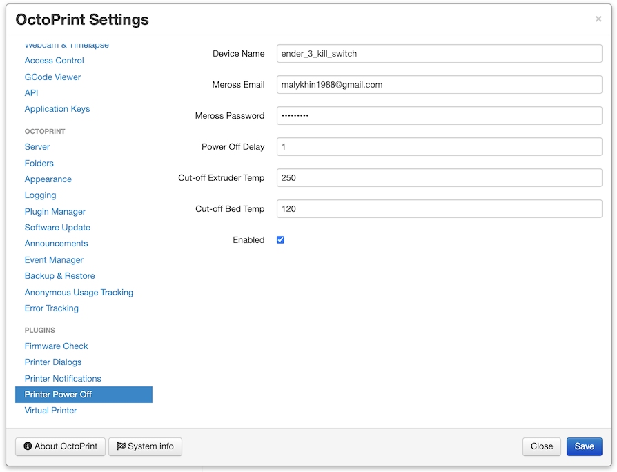

# OctoPrint-Printer_poweroff

Octoprint plugin to power off printer features in cases of:

- successful print;
- print cancelled because of the error;
- extruder or bed overheat.

Works with Meross smart plugs.

## Setup

Install manually using this URL:

    https://github.com/malykhin/OctoPrint-Printer_poweroff/archive/master.zip

## Settings

Plugin setup is done via this screen:

Breakdown:

- `Device Name` - smart socket name. Use the Meross app to check/change it.
- `Meross Email` / `Meross Password` - Your Meross app credentials
- `Power Off Delay` - number of seconds from printer finishes print and power-off event.
- `Cut-off Extruder Temp` / `Cut-off Bed Temp` - Maximum extruder and bed temperatures. The printer will be shut off immediately if reached.
- `Enabled` - enables power-off on print end or error. The temperature guard works when the plugin is installed and is not controlled by this checkbox.
